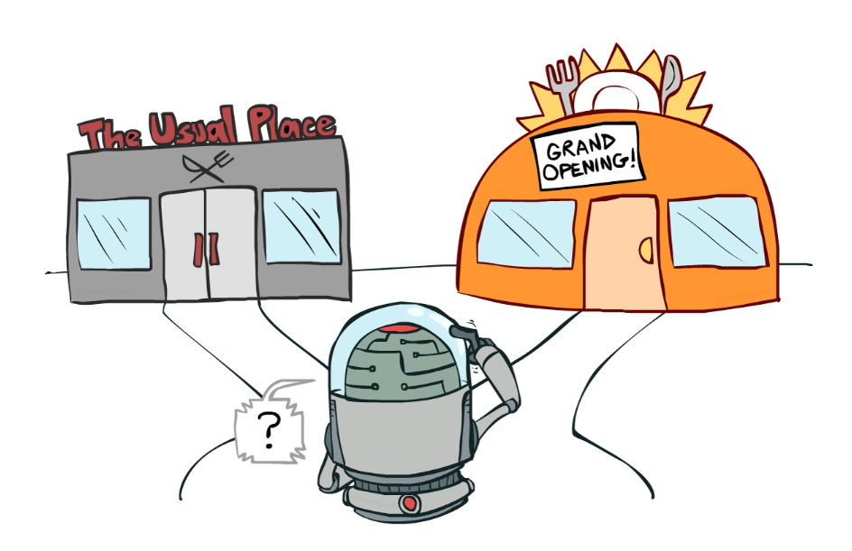
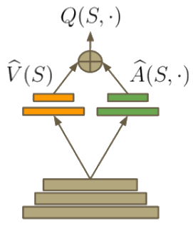
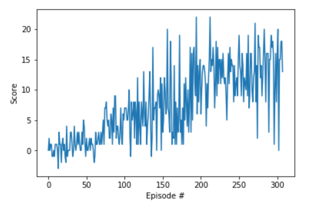

# Report
This is the report for the Udacity Reinforcement Learning Nanodegree Programm.  

# Learning Algorithm

The report describes the learning algorithm, along with the chosen hyperparameters. It also includes information on the selected model architectures for the neural network.

## Base-line knowledge

Reinforcement learning is a fundamental type of machine learning that stands along with supervised and unsupervised learning methods. We use supervised learning when for example we have some labeled dataset, and we would like to predict labels for unseen data (like cancer detection based on MRI images or stock price prediction based on previous time series data). When we would like to make sense of dataset that does not contain any labels, we use unsupervised learning methods, for example, we want to detect fraudulent transactions (anomaly detection) or cluster users by their preferences. In contrast with supervised and unsupervised types of learning, reinforcement learning does not apply to the dataset directly but tries to make sense of an environment by making actions and receiving rewards.

* Supervised learning: $\overline{y}=\hat{f}(\overline{x})$. Given pair of input and output pair $\overline{x}, \overline{y}$ need to approximate mapping function $\hat{f}$.
* Unsupervised learning: $\hat{f}(\overline{x})$. Given a set of input data $\overline{x}$ and the goal is to find a compact description $\hat{f}$ of the data.
* Reinforcement learning: $\hat{y}=\hat{f}(\overline{x}), \; \overline{R}$. Given a set of input data $\overline{x}$ and associated rewards and the goal is to find a function $\hat{f}$ that would generate $\hat{y}$.


Figure: agent-environment interaction (courtesy of [Mark Lee](http://www.incompleteideas.net/book/ebook/node28.html))

An agent is the decision-making mechanism in RL that interacts with an environment and tries to maximize the cumulative rewards received.  

$$\sum_i^nR_i = \underset{\text{past rewards}}{\underbrace{R_1+R_2}}+...+\underset{\text{current reward}}{\underbrace{R_t}}+\underset{\text{future reward }G}{\underbrace{R_{t+1}+R_{t+2}+...}}$$

Environment distinguish by episode length:

* Episodic task $n$- finite, where episode end at some timestep $T$;
* Continuous task $n=\infty$, where interaction is continuous and without limit.

Let us introduce a notion of a discount factor. The discount factor is used to adjust the behavior of an agent for the future rewards, for example, the value of 100$ today is not the same as in 3 years. Current(immediate) rewards are more valuable than the same reward in the future.

$$G_t = \gamma^0 R_{t+1}+\gamma^1 R_{t+2}+\gamma^2 R_{t+3}+\gamma^3 R_{t+4}+...$$

, where $\gamma$ can be varied from 0 (an agent cares only for the current reward) to 1 (an agent cares about the future rewards more than the current reward).

[Markov Decision Process](https://en.wikipedia.org/wiki/Markov_decision_process) (MDP) is a mathematical framework for modeling decision making in situations where outcomes are partly random and partly under the control of a decision maker. MDP is defined by:

* a finite set of states $S$;
* a finite set of actions $A$;
* a finite set of rewards $R$;
* the one-step dynamics of the environment $P(S',R;S,A) = P(S_{t+1}=S', R_{t+1}=R;S_t=S, A_t=A)$;
* discout rate $\gamma \in [0, 1]$.

A policy is a form of mapping of state to action, where policy returns probability taking action $a$ in-state $s$.

$$\pi: S \times A \rightarrow [0,1]$$
$$\pi(A|S) = P(A_t = a| S_t = s)$$

State-value function yelds a value of excepted return for each state, if the agent is started in that state and followed the policy for all the time-steps. The value of the state $S$ under a policy $\pi$ is:

$$V_{\pi} (S) = E_{\pi} [G_t|S_t = s]$$

Bellman expectation equation:

$$\underset{\text{value of any state}}{\underbrace{V_{\pi}(S)}} = E_{\pi}[\underset{\text{current reward}}{\underbrace{R_{t+1}}}+ \underset{\text{discoutented future rewards}}{\underbrace{\gamma V_{\pi}(S_{t+1})}} | S_t = s]$$

The primary objective is to find an optimal policy that results in the highest cumulative reward. An optimal policy is guaranteed to converge(exist), but may not be unique. A policy is called optimal if and only if it results in the best value for every state.

$$\pi' \geq \pi \Leftrightarrow V_{\pi'}(s) \geq V_{\pi'}(s) \forall s\in S$$

Action-value function $q_{\pi}$ for policy $\pi$ is the value of taking action $a$ in state $s$ following policy $\pi$:

$$q_{\pi}(s,a) = E_{\pi} [G_t|S_t=s, A_t = a]$$


Reinforcement learning algorithms:

* Model-Based Learning(Dynamic Programming):
  * Policy Iteration
  * Value Iteration (Deep Q-Learning)
* Model-Free Learning
  * Monte Carlo Methods
  * Temporal-Difference Learning

## Greedy policy

The Q-table is used to estimate the action-value function. If the agent follows a policy for many episodes, we can use the result to evaluate the action-value policy corresponding to the same policy directly. Q-table is a table that maps states to actions.

$$Q(S_0, A_0) = Q(S_0, A_0) + \alpha (R_1 + \gamma Q(S_1, A_1) - Q(S_0, A_0))$$

The greedy policy is based on the condition to take an action that yields the highest expected reward at a specific state. It is like dining at your favorite restaurant, which maximizes the received reward regarding pleasure.

$$A' = max_a (Q(S', :))$$

Following the greedy policy, most of the time would not be an effective strategy because the agent never learns what other actions might bring a higher reward. This problem is called "exploration vs. exploitation dilemma", when the agent needs to force its self to go out of the comfort zone and explore possible more rewarded actions. The solution to this problem is to use the **epsilon-greedy policy**.



Exploration-Exploitation Dilemma ([Source](http://slides.com/ericmoura/deck-2/embed))

The epsilon-greedy policy is a stochastic setup, where the agent explores the environment with probability $\epsilon$ by taking uniform random action or following greedy policy with likelihood $1-\epsilon$.

## DQN

DQN stands for Deep Q-Network, it is a type of reinforcement learning algorithm that is showing its efficiency for many RL setups. The first significant improvement to DQN was introduced by London-based company DeepMind when their team introduced several enhancements to DQN and showed the validity of the agent by playing many Atari games at superhuman performance level. They published the research paper titled "[Human-level control through deep reinforcement learning](https://www.nature.com/articles/nature14236)" in Nature.

Let me introduce the loss function for DQN:

$$L_i(w)=E_{(s,a,r,s')}[\underset{Q_{target}}{\underbrace{(r+\gamma \; \underset{a'}{max} \; \hat{Q}(s',a';w^-_i)}}-Q(s,a;w_i))^2]$$

DeepMind uses a neural network as function approximator for mapping state-to-action based on Q values. Because of nonlinearity introduced by using neural networks, the whole DQN algorithm becomes unstable and could diverge from solution. The instability has several causes: 

1. strong correlation between sequences of observations (solution is to use Experience replay)
2. correlation between $Q$ and $Q_{target}$ network (solution is to use Fixed $Q_{target}$).

### Experience replay

The basic concept of experience replay comes from biology, where human brain receives information and learns something during the day, but in the night time the bain grows neural connections and reflect on the experience that was gathered during the daytime. Concerning the RL agent the process looks like the following:

```
[EX] initialize experience replay buffer
[S] get the initial state
while current time < final time
    [A]     <- agents selects action 
    [S',R'] <- get responce from env
    [EX]    <- [S, A, R', S'] append buffer
    [S]     <- [S'] update old state value
    if [EX] buffer is full, then
        learn randomly from [EX]
```

In essence, the agent collects tuples $<S_t, A_t, R_{t+1}, S_{t+1}>$ while interacting with the environment and after reaching some threshold, starts to learn the collected mapping. To break to correlation, uniformly sample experiences from the buffer during learning.

### Fixed Q target

$$\nabla w = \alpha \; \underset{TD \; error}{\underbrace{\underset{Q_{target}}{\underbrace{(r(s,a) + \gamma \; \underset{a}{max} \; Q(s',a';w^-_i)}} - \underset{Q_{value}}{\underbrace{Q(s, a, w))}}}} \; \underset{Gradient \; Q_{value}}{\underbrace{\nabla_w Q(s,a,w)}}$$

TD error is the same term that is used to compute the loss. Loss measures how far predicted value from the expected solution. While learning oscillations occurs because $Q_{target}$ and $Q$ share the same weights, it like trying to shot an arrow to the target, but the target is always moving. It was shown that the use of two identical by architecture, but different by weights, the neural network would solve the oscillation problem. Coming back to arrow analogy, we will force the target to remain still for some time. In terms of algorithm, $Q_{target}$ (aka "old") and $Q$ (aka "new") networks update weights of the old with new network once every $T$ iteration.

## Double DQN

Double DQN was first introduced by [Hado van Hasselt](https://arxiv.org/abs/1509.06461) where he showed that state of the art deep Q-learning algorithm is prone to overestimate action values for some Atari 2600 domain. Double DQN is the specific adaptation, which reduces the observed overestimation and improves performance on several games.

Let us take a look at how we select next action in the DQN algorithm. By definition, the algorithm states that it sould take the action, which yields maximum Q value. We know that quality of Q value is higher when the agent explores an environment better by visiting all the states and taking all the actions.

$$\nabla w = \alpha \; {{\underset{Q_{target}}{\underbrace{(r(s,a) + \gamma \; \underset{a}{max} \; Q(s',a';w^-_i)}} - \underset{Q_{value}}{\underbrace{Q(s, a, w))}}}} \; \underset{Gradient \; Q_{value}}{\underbrace{\nabla_w Q(s,a,w)}}$$

At the begging the agent does not have a reasonable estimate for the Q-value table, it is noisy. Hence the agent cannot reliably use the Q value without bias. The solution is to use Double DQN, which decouples selection of the best action and Q value estimation.

$$Q_{target} = r(s,a) + \gamma \; \underset{Estimated \; by \; Q_{target}}{\underbrace{ Q(s', \underset{Q_{value} \; \text{network}}{\underbrace{\underset{a}{argmax} \; Q(s',a)}})}}$$

1. $indx = [\underset{a}{argmax} \; Q(s',a)]$; Find the action number that gives the highest reward for the next state. Use current $Q_{value}$ network for this step.
2. $Q(s', indx)$; Use $Q_{target}$ network to get the Q value for the state-action pair.

```python
states, actions, rewards, next_states, dones = experiences
# Get index of maximum value for next state from Q_expected
Q_argmax = self.qnetwork_local(next_states).detach().argmax(1)
# Get max predicted Q values (for next states) from target model
Q_targets_next = self.qnetwork_target(next_states).detach()[0,Q_argmax].unsqueeze(1)
# Compute Q targets for current states 
Q_targets = rewards + (gamma * Q_targets_next * (1 - dones))
# Get expected Q values from local model
Q_expected = self.qnetwork_local(states).gather(1, actions)
# Compute loss
loss = F.mse_loss(Q_expected, Q_targets)
```

## Dueling Networks

[ZiyuWang at el.](https://arxiv.org/abs/1511.06581) presented a new neural network architecture for model-free reinforcement learning, where network two separete estimators: 

* for the state value function $V(s)$
* for the state-dependent action value function $A(s,a)$

$$Q(s,a) = A(s,a) + V(s)$$

Dueling DQN finds a better policy and outperforms state-of-the-art RL agent on the Atari 2600 domain. As shown in the figure, the network separates into two branches and after collapses into one action space. The primary advantage of using such architecture is that it helps the agent to get knowledge of the states ($V(s)$) without exploring all the actions available in that state. 



Figure courtesy of [Kai Arulkumaran](http://torch.ch/blog/2016/04/30/dueling_dqn.html)

$$Q(s,a, w) = V(s;w) + (A(s,a;w) - \frac{1}{A}\sum_{a'}A(s,a';w))$$

```python
class DuelingQNetwork(nn.Module):
    
    def __init__(self, state_size, action_size, seed, fc1_size = 64, fc2_size = 64):
        super(DuelingQNetwork, self).__init__()
        self.num_actions = action_size
        fc3_1_size = fc3_2_size = 32
        self.seed = torch.manual_seed(seed)
        self.fc1 = nn.Linear(state_size, fc1_size)
        self.fc2 = nn.Linear(fc1_size, fc2_size)
        ## Here we separate into two streams
        # The one that calculate V(s)
        self.fc3_1 = nn.Linear(fc2_size, fc3_1_size)
        self.fc4_1 = nn.Linear(fc3_1_size, 1)
        # The one that calculate A(s,a)
        self.fc3_2 = nn.Linear(fc2_size, fc3_2_size)
        self.fc4_2 = nn.Linear(fc3_2_size, action_size)

    def forward(self, state):
        """Build a network that maps state -> action values."""
        x = F.relu(self.fc1(state))
        x = F.relu(self.fc2(x))
        val = F.relu(self.fc3_1(x))
        val = self.fc4_1(val)
        adv = F.relu(self.fc3_2(x))
        adv = self.fc4_2(adv)
        # Q(s,a) = V(s) + (A(s,a) - 1/|A| * sum A(s,a'))
        action = val + adv - adv.mean(1).unsqueeze(1).expand(state.size(0), self.num_actions)
        return action
```

## Hyperparameters

Hyperparameters tuning is an important step to make the model robust to variation in input data and to gain optimal performance. Andrew Ng has an excellent course on coursera [Improving Deep Neural Networks: Hyperparameter tuning, Regularization and Optimization](https://www.coursera.org/learn/deep-neural-network).

| Parameter name             | value |
| -------------------------- | ----- |
| max number of episodes     | 200   |
| max time-steps             | 1000  |
| eps greedy init            | 1.0   |
| eps greedy decay rate      | 0.995 |
| eps greedy min             | 0.01  |
| memory buffer size         | 1e5   |
| batch size                 | 64    |
| gamma(discount rate)       | 0.99  |
| tau(fixed Q-target update) | 1e-3  |
| learning rate              | 5e-4  |
| C(update rate in fixed Q)  | 4     |

# Plot of Rewards

The environment considered as being solved if an agent would get an average of +13 reward over 100 consecutive episodes.

My results is +13.00 reward in 288 episodes.



# Ideas for Future Work

For further performance improvement should implement Priority Experience Replay (PER).